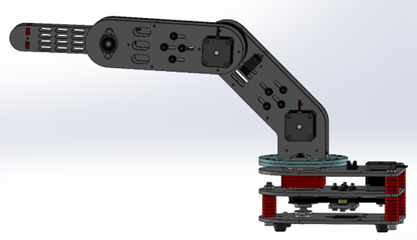
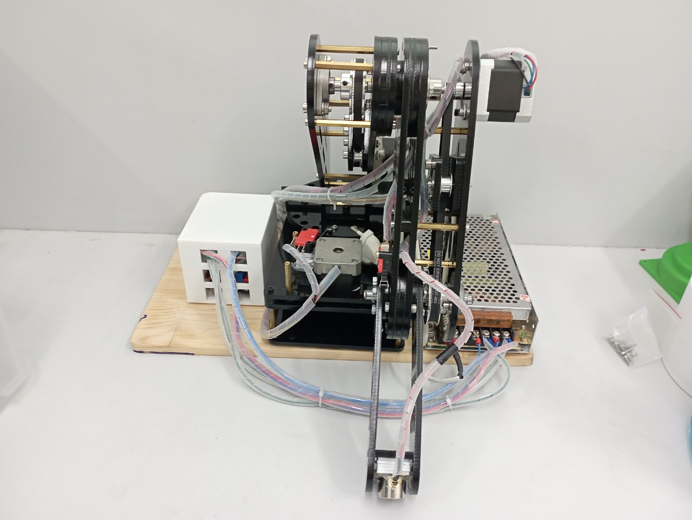
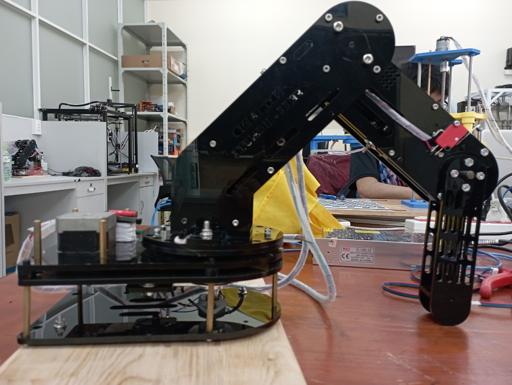
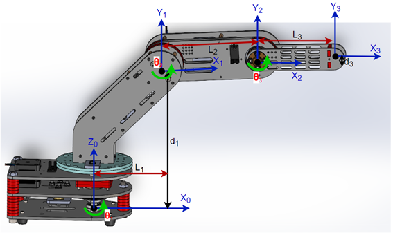
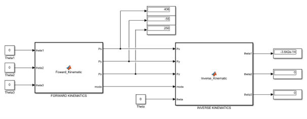
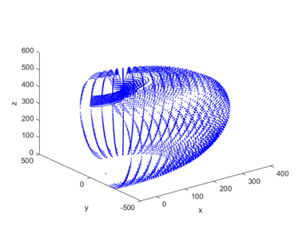
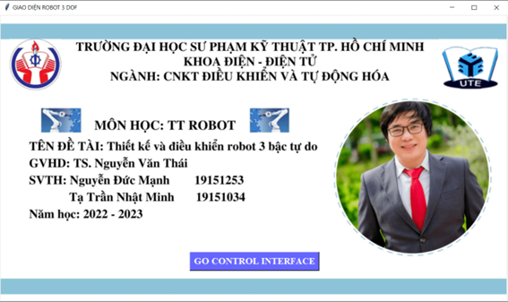
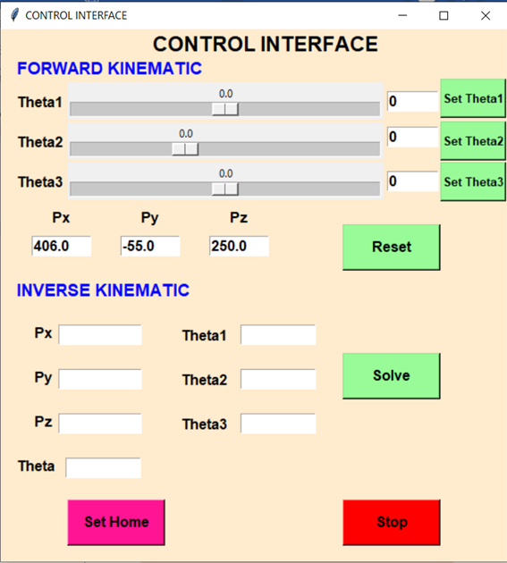

 <h1 align="center">Robotics in Practice Project</h1>

# Introduction
This project designs and constructs a 3-degree-of-freedom robotic arm model. Calculating and testing kinematics, drawing workspaces and planning the trajectory for robots. Then write the program and control the 3-DOF robot in practice.

# Design and construction of a 3-DOF robot arm model
The 3-degree-of-freedom robot arm model is designed on SolidWorks software as shown below:

   
  <i>Robot 3-DOF in Solidworks</i>

The model of 3-DOF robot arm in practice after construction is as follows:

  
  

# Calculation and kinematic testing for 3-DOF robot
* The purpose of the forward kinematics problem is to determine the position of the final action of the manipulator when the joint variables of the manipulator are known.
* The purpose of the inverse kinematics problem is to find the joint variables of the manipulator when the position of the last action of the manipulator is known. There are two methods to solve the inverse kinematics problem: the geometric method and the algebraic method.

   
  <i>Coordinate axes of robot 3-DOF</i>

The physical parameter table of the model:

| Parameters Robot 3-DOF   | Meaning     |
|--------------------------|:----------:|
| L1 = 105mm               | Length of link 1 | 
| L2 = 162mm               | Length of link 2 |
| L3 = 130mm               | Length of link 3 | 
| d1 = 270mm               | Deviation of the joint | 
| d3 = 55mm                | Deviation of the joint | 

*	Check the results of kinematics on Matlab Simulink

   
  <i>Simulate angle value matching 3 angles theta = 0</i>

# Drawing workspaces robot 3-DOF arm
The robot's workspace is the area containing the points and positions that the robot's end mechanism can reach. By determining the workspace of the robot, we can meet the requirements and tasks of the robot in reality, as well as upgrade and improve the robot later.
To determine the workspace of the robot, the team used the results of forward kinematics and based on the solutions of the inverse kinematics to build a program to draw the workspace on Matlab software. The figure below shows the workspace output after running the program.

   
  <i>Predictive neural network model</i>

# Program and Interface Control
To facilitate the control and monitoring of the robot's activities, the matching variable values, the work coordinates. The team created the console on the Sublime Text software using the Python language.

   
  <i>Opening interface</i>

   
  <i>Interface Control</i>

Interface function:
* **Set Home button**: run the robot model in the Set Home position.
* **STOP button**: stop running the robot model.
* **RESET button**: reset the value of theta angles to 0.
* **SOLVE button**: calculate angle theta 1,2,3 from the given position of Px, Py, Pz.
* **Enter the simulated angle in 2 ways**: drag the slider or enter it directly.
* **Inverse kinematics**: synchronous control of joints.

# Experiments results
Detailed instructions for calculating forward and reverse kinematics, designing a 3-DOF robot model on SolidWorks software, programming Arduino and designing a control interface on Python as follows: https://youtu.be/alXVkWIuink

Demo in real-time to test Forward and Inverse kinematics: https://youtu.be/NMyBhp15TCM
